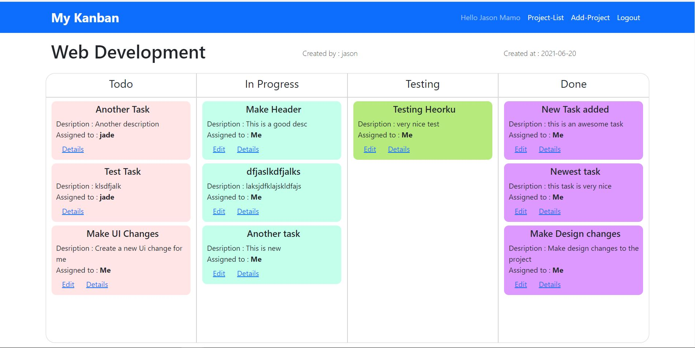
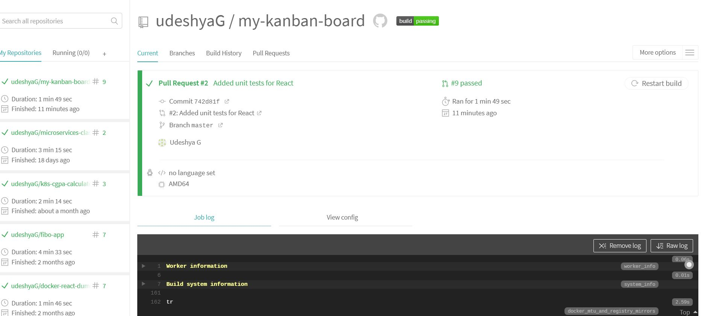
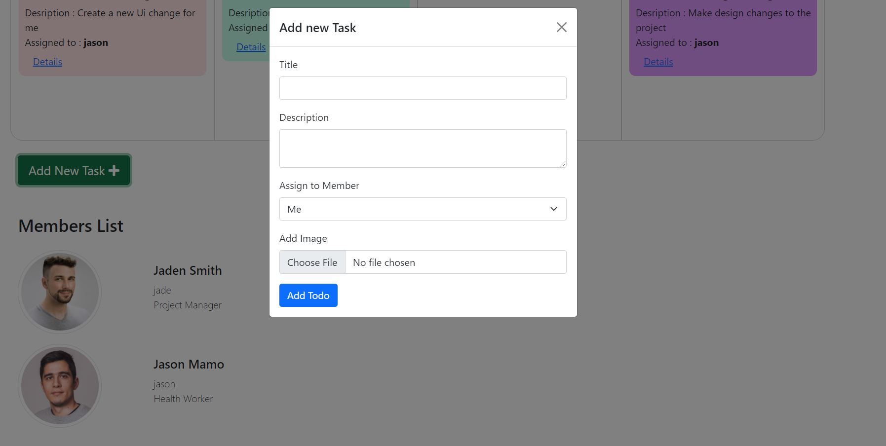
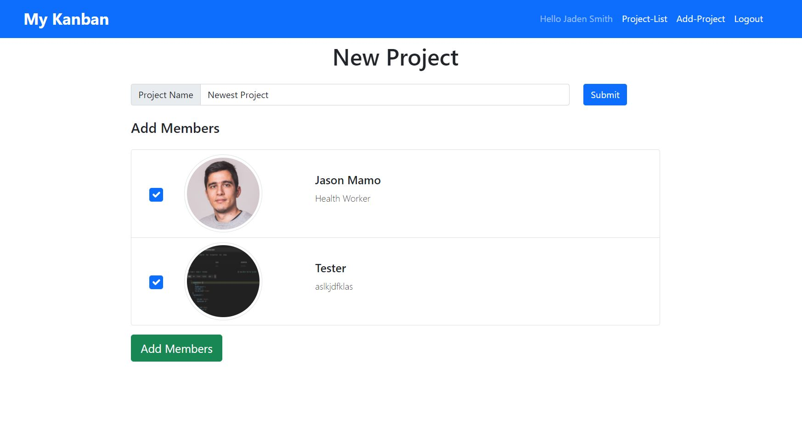
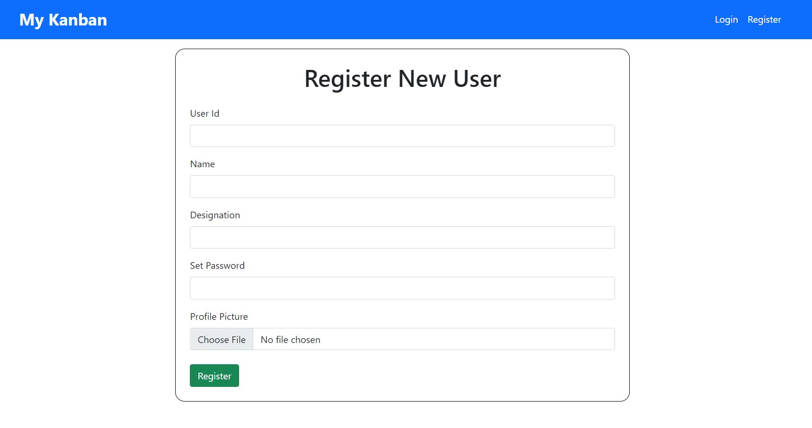
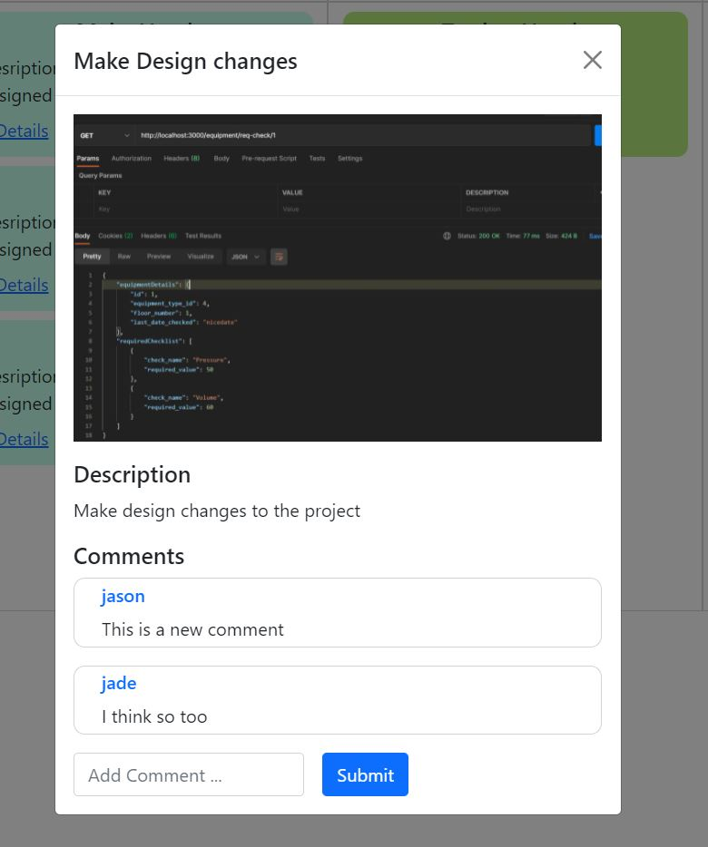
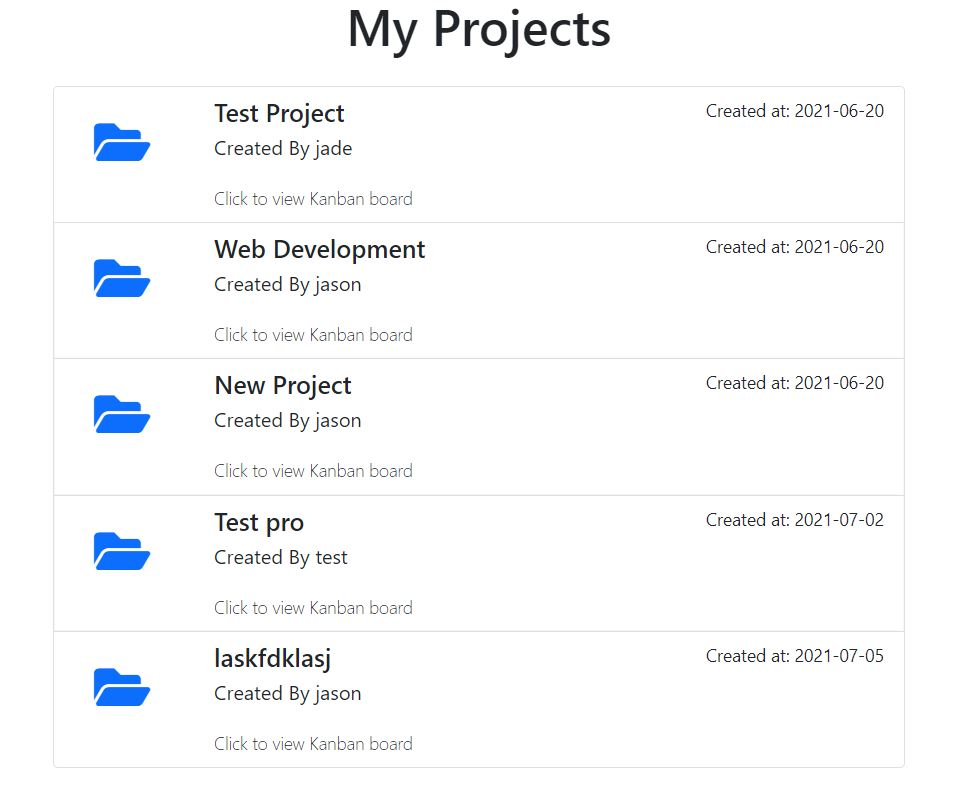

# Full Stack Kanban Board

### [Click Here](https://ancient-waters-77774.herokuapp.com) to view app 🚀

### Technology used

- React (Front End Framework) ⚛
- Node JS with Express (Back end)
- Postgres SQL (Database) 💾
- AWS S3 (Image storage) ☁
- Heroku (Deployment) ⚡
- Travis CI (Automated Testing) 👷‍♂️

---

1. `Kanban Board`


2. `Travis CI dashboard for automated testing`


3. `Add a new task to the board. Image of the task get saved to S3 ☁`


4. `Add a new Project and add members to the project`


4. `Register a new User`


3. `Details of a task and comments for a task. All members can see the details. Only the user who is assigned can edit a task`


5. `List all projects associated with a member. Clicking on the project opens the Kanban Board`


---

### Steps to run project locally
Make sure you have `PostgresSQL` and `NodeJS` installed locally

1. Clone the Github repository

2. Install all dependencies for node and react

3. Migrate the database and run backend server
```
npm run migrate
npm run start
```

3. Run the react client server
```
cd client
npm run start
```